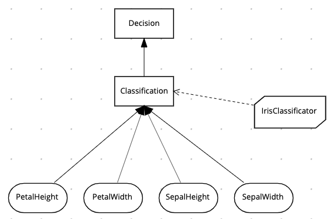
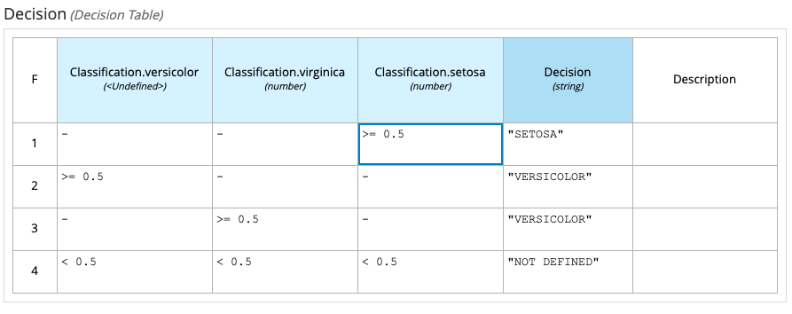

# Kogito DNM for Iris Flower Classification

Demonstrates Deep Learning integration into Kogito DMN.

The Iris Flower Classification is a hello world example in machine learning for multi class classification. 
Multi class classification is task of assigning input to one of several predefined categories. 
The task for Iris flower classification is to assign flowers into one of three categories based on 4 input values which 
represent petal and sepal dimensions (with and height).

# Decision logic



### Input data
- PetalHeight
- PetalWidth
- SepalHeight
- SepalWidth

### Business Knowledge Model
- **IrisClassificator** trained on [iris.txt](src/main/resources/iris.txt) dataset
```
MultiClassClassifierNetwork.builder()
        .inputsNum(4)
        .hiddenLayers(16)
        .outputsNum(3)
        .maxEpochs(9000)
        .maxError(0.03f)
        .learningRate(0.01f)
        .trainingSet(trainTest[0])
        .build();
```

### Decisions
- Classification returns key-values of each class (setosa, versicolor, virginica) probabilities using **IrisClassificator** BKM
- Decision returns selected class based on the following decision table




# How to
#### Start application
```
mvn clean compile quarkus:dev
```

### Call service command-line
```
curl -X POST "http://localhost:8080/iris" -H  "accept: application/json" -H  "Content-Type: application/json" -d "{\"PetalHeight\":0.64556962,\"PetalWidth\":0.795454545,\"SepalHeight\":0.202898551,\"SepalWidth\":0.08}"
```

### Call service in browser
```
open http://localhost:8080/swagger-ui/
```

### Expected response
```
{
  "SepalHeight": 0.202898551,
  "PetalWidth": 0.795454545,
  "PetalHeight": 0.64556962,
  "Classification": {
    "virginica": 1.0529712e-17,
    "setosa": 0.99994683,
    "versicolor": 0.000053133565
  },
  "SepalWidth": 0.08,
  "IrisClassificator": "function IrisClassificator( pH, pW, sH, sW )",
  "Decision": "SETOSA"
}
```
